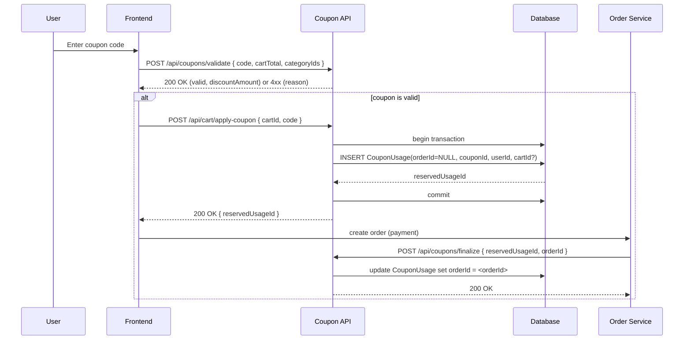

Coupon API Integration Guide

Base paths used by this project (router is mounted at `/api`):
- Admin operations: POST /api/admin/coupons
- Public/Cart operations: POST /api/coupons/validate, POST /api/cart/apply-coupon, DELETE /api/cart/remove-coupon/:cartId

Endpoints

1) Create coupon (Admin)
- POST /api/admin/coupons
- Body (example):
{
  "code": "SUMMER20",
  "name": "Summer Sale 2025",
  "type": "PERCENTAGE",
  "discountValue": "20",
  "minOrderValue": "100.00",
  "maxDiscountAmount": "50.00",
  "usageLimitTotal": 1000,
  "usageLimitPerUser": 2,
  "validFrom": "2025-09-01T00:00:00.000Z",
  "validUntil": "2025-10-01T00:00:00.000Z",
  "isActive": true,
  "isNewUserOnly": false,
  "categoryIds": [1,2,3]
}
- Success: 201 Created with coupon object

2) Validate coupon
- POST /api/coupons/validate
- Body (example):
{
  "userId": 123,
  "code": "SUMMER20",
  "cartTotal": "150.00",
  "categoryIds": [1]
}
- Success: { valid: true, discount: "30.00" }
- Possible error reasons: NOT_FOUND, INACTIVE, NOT_STARTED, EXPIRED, MIN_ORDER_NOT_MET, CATEGORY_MISMATCH, USAGE_LIMIT_EXCEEDED, USER_USAGE_LIMIT_EXCEEDED

3) Apply coupon (reserve usage)
- POST /api/cart/apply-coupon
- Body (example):
{
  "userId": 123,
  "cartId": 456,
  "code": "SUMMER20"
}
- Success: { reservedUsageId: 42, couponId: 7 }
- The call reserves a CouponUsage row (orderId=null) inside a transaction to avoid races.

# Coupon API (v1)

Base URL: https://<your-domain>/api

This document covers all coupon-related endpoints: create, read, update, delete, list, apply, validate, deactivate and user-scoped coupon endpoints.

Authentication note: endpoints requiring a JWT use the Authorization header:
`Authorization: Bearer <token>`

Standard JWT claims used:
- `iss` — issuer (service issuing the token)
- `sub` — subject (usually user id)
- `exp` — expiry (unix timestamp)
- `role` — user role (e.g., ADMIN, USER)

---

## POST /api/coupons
Endpoint summary
Create a new coupon; admin-only. Optionally associate the coupon with specific user IDs (assignment). If no `userIds` provided the coupon is global.

HTTP method & full path
POST /api/admin/coupons

Authentication
JWT required (admin). Header:
`Authorization: Bearer <token>`

Request specification

Path parameters

| name | type | required | description |
|---|---:|:---:|---|
| (none) |  | no |  |

Query parameters

| name | type | required | description |
|---|---:|:---:|---|
| (none) |  | no |  |

JSON body schema
```json
{
  "code": "SUMMER20",
  "name": "Summer Sale 2025",
  "type": "PERCENTAGE",
  "discountValue": "20",
  "minOrderValue": "100.00",
  "maxDiscountAmount": "50.00",
  "usageLimitTotal": 1000,
  "usageLimitPerUser": 2,
  "validFrom": "2025-09-01T00:00:00.000Z",
  "validUntil": "2025-10-01T00:00:00.000Z",
  "isActive": true,
  "isNewUserOnly": false,
  "categoryIds": [1,2,3],
  "userIds": [123, 456]
}
```

Field descriptions

| name | type | constraints | meaning |
|---|---:|---|---|
| code | string | required, unique | Coupon code typed by user (case-insensitive lookup). |
| name | string | optional | Human-readable name. |
| type | string | enum: PERCENTAGE \| FIXED | Discount calculation type. |
| discountValue | string \| number | required | Value for discount: if PERCENTAGE -> percent number (e.g. "10"); if FIXED -> fixed amount (e.g. "15.00"). Stored as string in some flows to preserve decimals. |
| minOrderValue | string \| number | optional | Minimum cart/order amount required. |
| maxDiscountAmount | string \| number | optional | Maximum discount amount (caps percent discounts). |
| usageLimitTotal | integer | optional | Max total redemptions across all users. |
| usageLimitPerUser | integer | optional | Max redemptions per single user. |
| validFrom | ISO8601 datetime | optional | Start time (inclusive). |
| validUntil | ISO8601 datetime | optional | End time (inclusive). |
| isActive | boolean | default true | Active flag; false makes coupon unusable. |
| isNewUserOnly | boolean | optional | If true only new users may use. |
| categoryIds | array[int] | optional | If provided, coupon only applies when cart contains these categories. |
| userIds | array[int] | optional | If provided, coupon is assigned only to these user IDs (assignment). Omit for global coupons. |

Example curl request
```bash
curl -X POST "https://<your-domain>/api/admin/coupons" \
  -H "Content-Type: application/json" \
  -H "Authorization: Bearer <ADMIN_JWT>" \
  -d '{
    "code":"SUMMER20",
    "name":"Summer Sale 2025",
    "type":"PERCENTAGE",
    "discountValue":"20",
    "minOrderValue":"100.00",
    "maxDiscountAmount":"50.00",
    "usageLimitTotal":1000,
    "usageLimitPerUser":2,
    "validFrom":"2025-09-01T00:00:00.000Z",
    "validUntil":"2025-10-01T00:00:00.000Z",
    "isActive":true,
    "isNewUserOnly":false,
    "categoryIds":[1,2,3],
    "userIds":[123,456]
  }'
```

Response specification

Success

- 201 Created
```json
{
  "id": 7,
  "code": "SUMMER20",
  "name": "Summer Sale 2025",
  "type": "PERCENTAGE",
  "discountValue": "20",
  "minOrderValue": "100.00",
  "maxDiscountAmount": "50.00",
  "usageLimitTotal": 1000,
  "usageLimitPerUser": 2,
  "validFrom": "2025-09-01T00:00:00.000Z",
  "validUntil": "2025-10-01T00:00:00.000Z",
  "isActive": true,
  "isNewUserOnly": false,
  "categoryIds": [1,2,3],
  "assignedUserIds": [123,456],
  "createdAt": "2025-09-02T13:00:00.000Z"
}
```

Errors

- 400 Bad Request
```json
{ "error": "INVALID_PAYLOAD", "message": "code is required" }
```
- 409 Conflict
```json
{ "error": "DUPLICATE_CODE", "message": "Coupon code already exists" }
```
- 401 Unauthorized
```json
{ "error": "UNAUTHENTICATED", "message": "Missing or invalid token" }
```

Notes & business rules
- If `userIds` present, coupon is only redeemable by those users.
- Creation is transactional: coupon row is created and assignment rows (if any) are created in the same transaction.
- Duplicate `code` is rejected.
- Admin must have role = ADMIN in JWT.
- Use `isActive` to quickly deactivate without deleting.

---

## GET /api/admin/coupons
Endpoint summary
List all coupons (admin). Returns paginated list when query params provided.

HTTP method & full path
GET /api/admin/coupons

Authentication
JWT required (admin). Header:
`Authorization: Bearer <token>`

Request specification

Path parameters

| name | type | required | description |
|---|---:|:---:|---|
| (none) |  | no |  |

Query parameters

| name | type | required | description |
|---|---:|:---:|---|
| page | integer | no | Page number (1-based). |
| limit | integer | no | Items per page. |
| active | boolean | no | Filter by active status. |
| code | string | no | Filter by partial/exact coupon code. |

JSON body schema

(no body expected)

Example curl request
```bash
curl "https://<your-domain>/api/v1/coupons?page=1&limit=25" \
  -H "Authorization: Bearer <ADMIN_JWT>" \
  -H "Accept: application/json"
```

Response specification

Success

- 200 OK
```json
{
  "data": [
    {
      "id": 7,
      "code": "SUMMER20",
      "name": "Summer Sale 2025",
      "isActive": true,
      "validFrom": "2025-09-01T00:00:00.000Z",
      "validUntil": "2025-10-01T00:00:00.000Z",
      "assignedUserIds": [123,456]
    }
  ],
  "meta": {
    "page": 1,
    "limit": 25,
    "total": 12
  }
}
```

Errors

- 401 Unauthorized
```json
{ "error": "UNAUTHENTICATED", "message": "Missing or invalid token" }
```

Notes & business rules
- If pagination params omitted, a default limit is applied.
- Admin view includes assigned user IDs for each coupon.

---

## GET /api/admin/coupons/:id
Endpoint summary
Retrieve a single coupon by id (admin).

HTTP method & full path
GET /api/admin/coupons/:id

Authentication
JWT required (admin). Header:
`Authorization: Bearer <token>`

Request specification

Path parameters

| name | type | required | description |
|---|---:|:---:|---|
| id | integer | yes | Coupon id |

Query parameters

| name | type | required | description |
|---|---:|:---:|---|
| (none) |  | no |  |

JSON body schema

(no body expected)

Example curl request
```bash
curl "https://<your-domain>/api/v1/coupons/7" \
  -H "Authorization: Bearer <ADMIN_JWT>"
```

Response specification

Success

- 200 OK
```json
{
  "id": 7,
  "code": "SUMMER20",
  "name": "Summer Sale 2025",
  "type": "PERCENTAGE",
  "discountValue": "20",
  "minOrderValue": "100.00",
  "maxDiscountAmount": "50.00",
  "usageLimitTotal": 1000,
  "usageLimitPerUser": 2,
  "validFrom": "2025-09-01T00:00:00.000Z",
  "validUntil": "2025-10-01T00:00:00.000Z",
  "isActive": true,
  "isNewUserOnly": false,
  "categoryIds": [1,2,3],
  "assignedUserIds": [123,456],
  "createdAt": "2025-09-02T13:00:00.000Z"
}
```

Errors

- 404 Not Found
```json
{ "error": "NOT_FOUND", "message": "Coupon not found" }
```
- 401 Unauthorized
```json
{ "error": "UNAUTHENTICATED", "message": "Missing or invalid token" }
```

Notes & business rules
- Includes `assignedUserIds` for visibility when coupon is user-specific.

---

## PUT /api/admin/coupons/:id
Endpoint summary
Update a coupon and (optionally) its assigned users. Admin-only.

HTTP method & full path
PUT /api/admin/coupons/:id

Authentication
JWT required (admin). Header:
`Authorization: Bearer <token>`

Request specification

Path parameters

| name | type | required | description |
|---|---:|:---:|---|
| id | integer | yes | Coupon id |

Query parameters

| name | type | required | description |
|---|---:|:---:|---|
| (none) |  | no |  |

JSON body schema
```json
{
  "name": "Updated Name",
  "isActive": false,
  "discountValue": "15",
  "userIds": [123,789]
}
```

Field descriptions

| name | type | constraints | meaning |
|---|---:|---|---|
| name | string | optional | Human-friendly name. |
| isActive | boolean | optional | Set to false to deactivate. |
| discountValue | string \| number | optional | New discount value. |
| userIds | array[int] | optional | When provided assignment list will be replaced with these user IDs (sync behavior). To remove all assignments, send an empty array. Omitting `userIds` preserves current assignments. |

Example curl request
```bash
curl -X PUT "https://<your-domain>/api/v1/coupons/7" \
  -H "Content-Type: application/json" \
  -H "Authorization: Bearer <ADMIN_JWT>" \
  -d '{
    "name":"Updated Name",
    "isActive":false,
    "userIds":[123,789]
  }'
```

Response specification

Success

- 200 OK
```json
{
  "id": 7,
  "code": "SUMMER20",
  "name": "Updated Name",
  "isActive": false,
  "assignedUserIds": [123,789]
}
```

Errors

- 400 Bad Request
```json
{ "error": "INVALID_PAYLOAD", "message": "invalid fields" }
```
- 404 Not Found
```json
{ "error": "NOT_FOUND", "message": "Coupon not found" }
```

Notes & business rules
- Assignment sync: when `userIds` is provided the service replaces existing assignments with the given set in a transaction.
- If `userIds` is omitted, existing assignments are unchanged.
- Deactivation is achieved by setting `isActive` to false.

---

## DELETE /api/admin/coupons/:id
Endpoint summary
Delete a coupon (admin). This removes coupon and assignment rows.

HTTP method & full path
DELETE /api/admin/coupons/:id

Authentication
JWT required (admin). Header:
`Authorization: Bearer <token>`

Request specification

Path parameters

| name | type | required | description |
|---|---:|:---:|---|
| id | integer | yes | Coupon id |

Query parameters

| name | type | required | description |
|---|---:|:---:|---|
| (none) |  | no |  |

JSON body schema

(no body expected)

Example curl request
```bash
curl -X DELETE "https://<your-domain>/api/v1/coupons/7" \
  -H "Authorization: Bearer <ADMIN_JWT>"
```

Response specification

Success

- 200 OK
```json
{ "deleted": true }
```

Errors

- 404 Not Found
```json
{ "error": "NOT_FOUND", "message": "Coupon not found" }
```
- 401 Unauthorized
```json
{ "error": "UNAUTHENTICATED", "message": "Missing or invalid token" }
```

Notes & business rules
- Deletion removes assignments and any reservation/usage rows per DB cascade rules.
- Consider using `isActive=false` to keep audit trail instead of hard delete.

---

## POST /api/coupons/validate
Endpoint summary
Validate a coupon code; legacy public endpoint that accepts userId in body. Use to check whether code is valid and compute discount.

HTTP method & full path
POST /api/coupons/validate

Authentication
JWT optional. If caller is server-to-server or frontend without login, pass userId in body. If JWT provided and contains sub claim, the service will use it (preferred).

Request specification

Path parameters

| name | type | required | description |
|---|---:|:---:|---|
| (none) |  | no |  |

Query parameters

| name | type | required | description |
|---|---:|:---:|---|
| (none) |  | no |  |

JSON body schema
```json
{
  "userId": 123,
  "code": "SUMMER20",
  "cartTotal": "150.00",
  "categoryIds": [1,2]
}
```

Field descriptions

| name | type | constraints | meaning |
|---|---:|---|---|
| userId | integer | optional | User id; if missing but JWT present, authenticated user's id is used. |
| code | string | required | Coupon code to validate. |
| cartTotal | string \| number | required | Cart total amount as decimal string or number. |
| categoryIds | array[int] | optional | Categories present in cart for category-limited coupons. |

Example curl request
```bash
curl -X POST "https://<your-domain>/api/coupons/validate" \
  -H "Content-Type: application/json" \
  -H "Authorization: Bearer <USER_JWT>" \
  -d '{
    "code":"SUMMER20",
    "cartTotal":"150.00",
    "categoryIds":[1,2]
  }'
```

Response specification

Success

- 200 OK
```json
{
  "valid": true,
  "couponId": 7,
  "code": "SUMMER20",
  "discountAmount": "30.00",
  "reason": null
}
```

Errors / invalid

- 400 Bad Request (missing fields)
```json
{ "valid": false, "error": "INVALID_PAYLOAD", "message": "code required" }
```
- 404 Not Found
```json
{ "valid": false, "error": "NOT_FOUND", "message": "Coupon not found" }
```
- 422 Unprocessable Entity (business rule)
Common failure reasons:
- NOT_STARTED — current time < validFrom
- EXPIRED — current time > validUntil
- INACTIVE — coupon isActive is false
- MIN_ORDER_NOT_MET — cartTotal < minOrderValue
- CATEGORY_MISMATCH — cart categories don't match coupon category rules
- USAGE_LIMIT_EXCEEDED — total usage reached
- USER_USAGE_LIMIT_EXCEEDED — user has exhausted per-user limit
- NOT_ASSIGNED_TO_USER — coupon is assigned to other users

Example error:
```json
{
  "valid": false,
  "error": "NOT_ASSIGNED_TO_USER",
  "message": "Coupon does not apply to this user"
}
```

Notes & business rules
- Validation does not reserve usage. Call apply endpoint to reserve usage for a cart (see apply endpoint).
- Coupon assignment: if coupon has assigned users, only those users pass validation.
- Category matching: at least one category match is required when coupon has `categoryIds`.
- All numeric money fields are returned as decimal strings.

---

## POST /api/cart/apply-coupon
Endpoint summary
Apply/reserve a coupon code for a cart (creates a reserved usage entry). Should be called when user attaches coupon to cart to avoid race conditions.

HTTP method & full path
POST /api/cart/apply-coupon

Authentication
JWT recommended/required for user context. Header:
`Authorization: Bearer <token>`

Request specification

Path parameters

| name | type | required | description |
|---|---:|:---:|---|
| (none) |  | no |  |

Query parameters

| name | type | required | description |
|---|---:|:---:|---|
| (none) |  | no |  |

JSON body schema
```json
{
  "userId": 123,
  "cartId": 456,
  "code": "SUMMER20"
}
```

Field descriptions

| name | type | constraints | meaning |
|---|---:|---|---|
| userId | integer | optional | User id; prefer JWT `sub`. |
| cartId | integer | required | Cart identifier to tie reserve to. |
| code | string | required | Coupon code to reserve. |

Example curl request
```bash
curl -X POST "https://<your-domain>/api/cart/apply-coupon" \
  -H "Content-Type: application/json" \
  -H "Authorization: Bearer <USER_JWT>" \
  -d '{
    "cartId":456,
    "code":"SUMMER20"
  }'
```

Response specification

Success

- 200 OK
```json
{ "reservedUsageId": 42, "couponId": 7, "message": "reserved" }
```

Errors

- 400 Bad Request
```json
{ "error": "INVALID_PAYLOAD", "message": "cartId required" }
```
- 409 Conflict (if reservation cannot be created due to usage limit)
```json
{ "error": "USAGE_LIMIT_EXCEEDED", "message": "Coupon fully redeemed" }
```
- 401 Unauthorized
```json
{ "error": "UNAUTHENTICATED", "message": "Missing or invalid token" }
```

Notes & business rules
- Operation should be transactional: create coupon usage row with orderId = null (reserved). If multiple users try to reserve the last slot, transaction prevents overbook.
- Frontend should finalize reservation by linking reserved usage to an order when payment succeeds; otherwise remove reservation or let expiry cleanup clear it.
- The endpoint returns reservedUsageId for later order linking or cleanup.

---

## DELETE /api/cart/remove-coupon/:cartId
Endpoint summary
Remove a reserved coupon from a cart (deletes reservation).

HTTP method & full path
DELETE /api/cart/remove-coupon/:cartId

Authentication
JWT required (user). Header:
`Authorization: Bearer <token>`

Request specification

Path parameters

| name | type | required | description |
|---|---:|:---:|---|
| cartId | integer | yes | Cart id whose coupon reservation must be removed |

Query parameters

| name | type | required | description |
|---|---:|:---:|---|
| (none) |  | no |  |

JSON body schema

(no body expected)

Example curl request
```bash
curl -X DELETE "https://<your-domain>/api/v1/cart/remove-coupon/456" \
  -H "Authorization: Bearer <USER_JWT>"
```

Response specification

Success

- 200 OK
```json
{ "removed": true }
```

Errors

- 404 Not Found
```json
{ "error": "NOT_FOUND", "message": "No reserved coupon found for cart" }
```
- 401 Unauthorized
```json
{ "error": "UNAUTHENTICATED", "message": "Missing or invalid token" }
```

Notes & business rules
- Deleting a reserved usage frees the redemption slot.
- If order has already been created and linked to the coupon usage, removal is disallowed and 409 Conflict is returned.

---

## GET /api/user/coupons
Endpoint summary
Return coupons available to the authenticated user — global coupons plus those specifically assigned.

HTTP method & full path
GET /api/user/coupons

Authentication
JWT required (user). Header:
`Authorization: Bearer <token>`

Request specification

Path parameters

| name | type | required | description |
|---|---:|:---:|---|
| (none) |  | no |  |

Query parameters

| name | type | required | description |
|---|---:|:---:|---|
| onlyActive | boolean | no | If true, only return active coupons. |
| page | integer | no | Pagination page. |
| limit | integer | no | Page size. |

JSON body schema

(no body expected)

Example curl request
```bash
curl "https://<your-domain>/api/user/coupons?onlyActive=true" \
  -H "Authorization: Bearer <USER_JWT>"
```

Response specification

Success

- 200 OK
```json
[
  {
    "id": 7,
    "code": "SUMMER20",
    "name": "Summer Sale",
    "isActive": true,
    "assigned": false,
    "validFrom": "2025-09-01T00:00:00.000Z",
    "validUntil": "2025-10-01T00:00:00.000Z"
  }
]
```

Errors

- 401 Unauthorized
```json
{ "error": "UNAUTHENTICATED", "message": "Missing or invalid token" }
```

Notes & business rules
- Returned set = global coupons (no assignments) union coupons assigned to the authenticated user.
- Admin-only coupons (if any flagged) are excluded.

---

## POST /api/user/coupons/validate
Endpoint summary
Validate a coupon for the authenticated user (preferred user-scoped validation — does not require userId in body).

HTTP method & full path
POST /api/user/coupons/validate

Authentication
JWT required (user). Header:
`Authorization: Bearer <token>`

Request specification

Path parameters

| name | type | required | description |
|---|---:|:---:|---|
| (none) |  | no |  |

Query parameters

| name | type | required | description |
|---|---:|:---:|---|
| (none) |  | no |  |

JSON body schema
```json
{
  "code": "SUMMER20",
  "cartTotal": "150.00",
  "categoryIds": [1,2]
}
```

Field descriptions

| name | type | constraints | meaning |
|---|---:|---|---|
| code | string | required | Coupon code. |
| cartTotal | string \| number | required | Cart total. |
| categoryIds | array[int] | optional | Cart categories. |

Example curl request
```bash
curl -X POST "https://<your-domain>/api/user/coupons/validate" \
  -H "Content-Type: application/json" \
  -H "Authorization: Bearer <USER_JWT>" \
  -d '{ "code":"SUMMER20", "cartTotal":"150.00", "categoryIds":[1] }'
```

Response specification

Success

- 200 OK
```json
{
  "valid": true,
  "couponId": 7,
  "discountAmount": "30.00"
}
```

Errors

- 401 Unauthorized
```json
{ "error": "UNAUTHENTICATED", "message": "Missing or invalid token" }
```
- 422 Unprocessable Entity (business rule failures — see `validate` endpoint errors above)

Notes & business rules
- Uses authenticated user id (JWT sub) to check per-user assignment and per-user usage limits.
- Same validation rules as legacy validate endpoint.

---

## Global: Deactivate coupon (business flow)
Endpoint summary
Deactivate a coupon quickly (admin) by setting `isActive` false; implemented via `PUT /api/v1/coupons/:id` by setting `isActive: false`.

HTTP method & full path
PUT /api/v1/coupons/:id

Authentication
JWT required (admin). Header:
`Authorization: Bearer <token>`

Notes & business rules
- Deactivation is preferred to deletion for auditability.
- Deactivating prevents future validations and reservations.

---

# Prisma schema changes (reference)

When coupons are assigned to specific users a join model is used. Example model snippets (add to `prisma/schema.prisma`):

```prisma
model Coupon {
  id                 Int                 @id @default(autoincrement())
  code               String              @unique
  name               String?
  type               CouponType
  discountValue      String
  minOrderValue      Decimal?
  maxDiscountAmount  Decimal?
  usageLimitTotal    Int?
  usageLimitPerUser  Int?
  validFrom          DateTime?
  validUntil         DateTime?
  isActive           Boolean             @default(true)
  isNewUserOnly      Boolean             @default(false)
  categoryIds        Int[]               @default([])
  createdAt          DateTime            @default(now())
  updatedAt          DateTime            @updatedAt

  assignments        CouponAssignment[]   // relation to assignments
  usages              CouponUsage[]       // existing usage relation
}
```

```prisma
model CouponAssignment {
  id        Int     @id @default(autoincrement())
  couponId  Int
  userId    Int
  coupon    Coupon  @relation(fields: [couponId], references: [id], onDelete: Cascade)
  user      User    @relation(fields: [userId], references: [id], onDelete: Cascade)

  @@index([couponId])
  @@index([userId])
  @@unique([couponId, userId])
}
```

Notes:
- After applying schema changes run:
  - `npx prisma migrate dev --name add-coupon-assignment`
  - `npx prisma generate`
- The `CouponAssignment` table stores which users a coupon is assigned to. If no assignment exists, coupon is global.

---

# Standard headers

- Content-Type: application/json
- Accept: application/json
- Authorization: Bearer <token> (when required)

# Common error object shape

All error responses follow a consistent shape:

```json
{
  "error": "ERROR_CODE",
  "message": "Human readable message",
  "details": { }
}
```

Common error codes:
- UNAUTHENTICATED — missing or invalid JWT
- FORBIDDEN — insufficient role (e.g., non-admin calling admin endpoint)
- NOT_FOUND — resource not found (coupon, reservation)
- INVALID_PAYLOAD — request validation failed
- DUPLICATE_CODE — coupon code already exists
- NOT_STARTED, EXPIRED, INACTIVE, MIN_ORDER_NOT_MET, CATEGORY_MISMATCH, USAGE_LIMIT_EXCEEDED, USER_USAGE_LIMIT_EXCEEDED, NOT_ASSIGNED_TO_USER — domain validation failures returned by validation endpoints

# Glossary

- couponCode — The text code the user enters (field `code`). Uniquely identifies a coupon.
- maxRedemptions (usageLimitTotal) — Maximum total number of times coupon can be redeemed.
- perUserLimit (usageLimitPerUser) — Maximum number of redemptions by a single user.
- assignedUserIds — Array of user ids the coupon is explicitly assigned to. When present coupon is non-global.
- appliesTo / categoryIds — If provided, coupon applies only when cart contains listed category ids.
- reservedUsage / reservedUsageId — A temporary reservation record created by apply endpoint (orderId = null) to avoid races; later linked to an order.
- isActive — Flag to enable/disable coupon quickly without deletion.
- newUserOnly / isNewUserOnly — If true only users marked as new (service-defined) may use coupon.

---

End of document.

## Diagrams

Below are simple, text-first diagrams (Mermaid) that illustrate the common coupon flows: validation, reservation (apply), order finalization, and removal/cleanup.

### Flowchart: Coupon reservation lifecycle

```mermaid
flowchart LR
  A[User enters coupon code] --> B{Validate coupon}
  B -->|valid| C[Apply / Reserve coupon (POST /api/cart/apply-coupon)\ncreate CouponUsage with orderId = null]
  B -->|invalid| D[Return error to frontend]
  C --> E{User proceeds to checkout}
  E -->|order created & paid| F[Finalize reservation - link CouponUsage to Order (set orderId)]
  E -->|coupon removed or cart abandoned| G[Remove reservation (delete CouponUsage) / let cleanup job expire]
  F --> H[Consume coupon: count towards usage limits]
  G --> I[Free up redemption slot]

  style C fill:#e6ffed,stroke:#2ecc71
  style F fill:#e6f7ff,stroke:#3498db

```

### Sequence: user -> frontend -> API -> DB -> order service



Notes
- These diagrams are text-first and editable in the repo. GitHub's markdown rendering may support Mermaid (or use a plugin). You can also render them to SVG using the Mermaid CLI (`mmdc`).

Want a separate `.mmd` file or an exported SVG checked into the repo? I can add either on your request.

